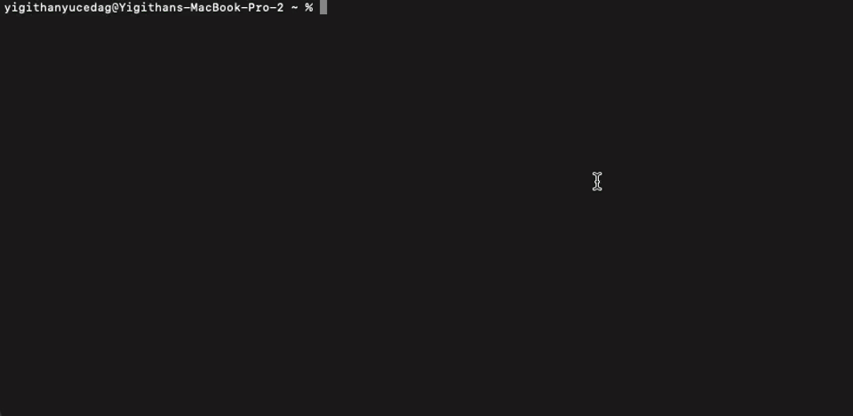
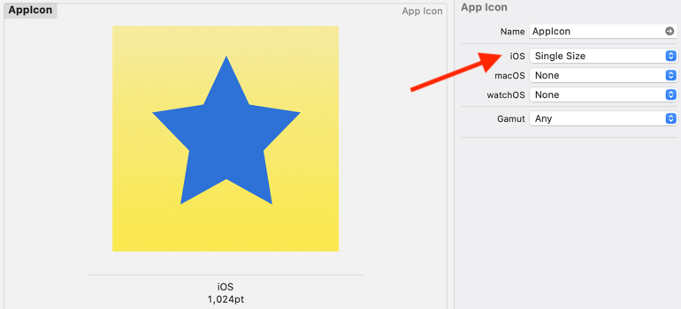

# macos-icon-generator

This is a simple script to generate all the app icons for macOS.



## Usage

You should provide a path to an image file. The image should be at least 1024x1024 pixels.

```
npx macos-icon-generator <path-to-image>
```

### Example

```
npx macos-icon-generator ./icon.png
```

## Features

- Select which icons to generate
- Specify output directory
- Generate all icons in one go
  - 16x16
  - 32x32
  - 64x64
  - 128x128
  - 256x256
  - 512x512
  - 1024x1024

## FAQ

### Why npx?

This package is meant to be used as a one-off script. It's not meant to be installed as a dependency. Using npx allows you to run the script without installing it. If you want to install it, you can do so with `npm install -g macos-icon-generator`. Then you can run it with `macos-icon-generator <path-to-image>`. Also npx fetches the latest version of the package.

### How can I generate icons for iOS?

Starting with Xcode 14, you don't need to generate separate icons for iOS. Just choose the Single Size option in the app icon’s Attributes inspector in the asset catalog.



## License

MIT
